<p align="center">
  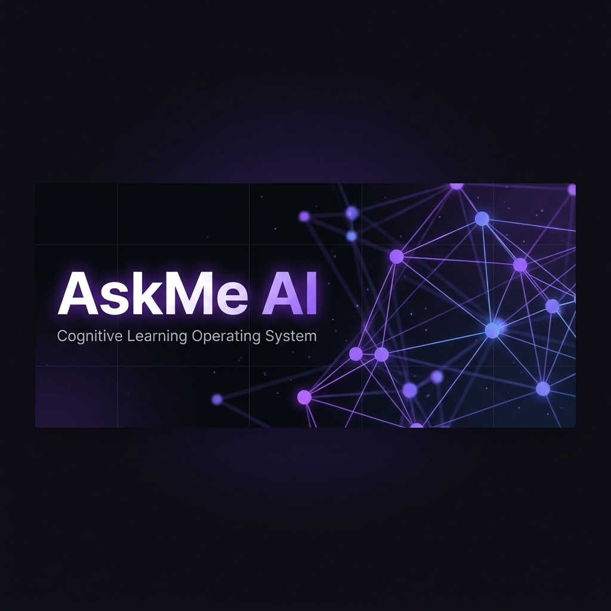
</p>

<p align="center">
  <strong>🧠 Your study material → AI-powered personal tutor in under 60 seconds</strong>
</p>

<p align="center">
  <a href="#-key-features"></a>
  <a href="#-tech-stack"></a>
  <a href="#-quick-start"></a>
  <a href="#-license"></a>
</p>

<p align="center">
  <a href="#-system-architecture">Architecture</a> •
  <a href="#-comparative-analysis">Comparison</a> •
  <a href="#-database-schema">Schema</a> •
  <a href="#-ai-pipeline">AI Pipeline</a> •
  <a href="#-quick-start">Quick Start</a>
</p>

---

## 🎯 What is AskMe AI?

**AskMe AI** is a **Cognitive Learning Operating System (CLOS)** that transforms any student's raw study material — PDFs, notes, textbooks — into a fully personalized AI tutor. Unlike generic chatbots, AskMe AI is grounded exclusively in *your* uploaded content using a Retrieval-Augmented Generation (RAG) pipeline, ensuring every answer, quiz, and recommendation comes directly from your study material.

> **The Core Promise:** Upload notes → Get an AI summary → Ask doubts with cited answers → Take adaptive quizzes → See your weak topics → Get a personalized revision plan. All in one session.

---

## ✨ Key Features

<table>
<tr>
<td width="50%">

### 📄 Intelligent Document Ingestion
Upload PDFs or text files. The system extracts text, splits it into semantic chunks with overlapping windows, generates 768-dimensional vector embeddings via **Gemini text-embedding-004**, and indexes everything in **pgvector** for instant retrieval.

### 🧠 RAG-Powered Doubt Solver
Ask any question about your material. The system embeds your query, performs cosine similarity search against your document vectors, retrieves the most relevant chunks, and generates precise answers with **source citations** — never hallucinating beyond your content.

### 🎯 AI Quiz Generator
Automatically generates MCQ quizzes from your uploaded material. Each question is topic-tagged, includes 4 options, a correct answer, and a detailed explanation. Quiz difficulty adapts based on the complexity of your content.

### 📊 Weak Topic Detection
After each quiz attempt, an AI diagnostics engine analyzes your wrong answers, identifies weak topics, and generates a **focused revision plan** with specific study actions and time estimates.

</td>
<td width="50%">

### 🔄 Reverse Teacher Mode (RTM)
Explain a concept in your own words, and the AI evaluates your explanation against the source material. Get scored on conceptual accuracy, see identified knowledge gaps, and receive targeted feedback — the most powerful active recall technique.

### 🧬 Cognitive DNA Profile
An 8-axis cognitive profile (Conceptual, Retention, Analytical, Discipline, Consistency, Adaptability, Calibration, Efficiency) that evolves as you study, revealing your unique learning archetype.

### 🕸️ 3D Memory Graph
A real-time topological knowledge map. Mastered concepts glow blue and stabilize; weak concepts pulse red with decay rings. Drag to rotate in 3D. Visualizes your entire knowledge architecture at a glance.

### 📅 AI Study Planner
Smart study session scheduler with cognitive intensity levels (Stealth Spacing → Accelerated Exam Sprint). Prioritize urgent topics, track daily goals, and earn XP for completed sessions.

</td>
</tr>
</table>

<details>
<summary><strong>🔥 Even More Features</strong></summary>

| Feature | Description |
|---------|-------------|
| 🔐 **Secure Authentication** | Supabase Auth with email/password, session management, and route protection |
| 🎮 **Gamification Engine** | XP system, daily study streaks, and progress tracking to maintain motivation |
| 🌗 **Dark/Light Themes** | Premium dark mode default with system-respecting theme toggle |
| 📱 **Responsive Design** | Fully responsive across desktop, tablet, and mobile viewports |
| ⚡ **Real-time Progress** | Live upload progress with stage-by-stage feedback (extracting → chunking → embedding → indexing) |
| 🎆 **Celebration Effects** | Confetti animations on quiz completion for positive reinforcement |
| 📈 **Analytics Dashboard** | Recharts-powered visualizations for quiz scores, study patterns, and topic mastery over time |
| 🔄 **Auto-generated Content** | Upload triggers automatic summary + quiz + knowledge graph node creation |

</details>

---

## 🏗️ System Architecture

<p align="center">
  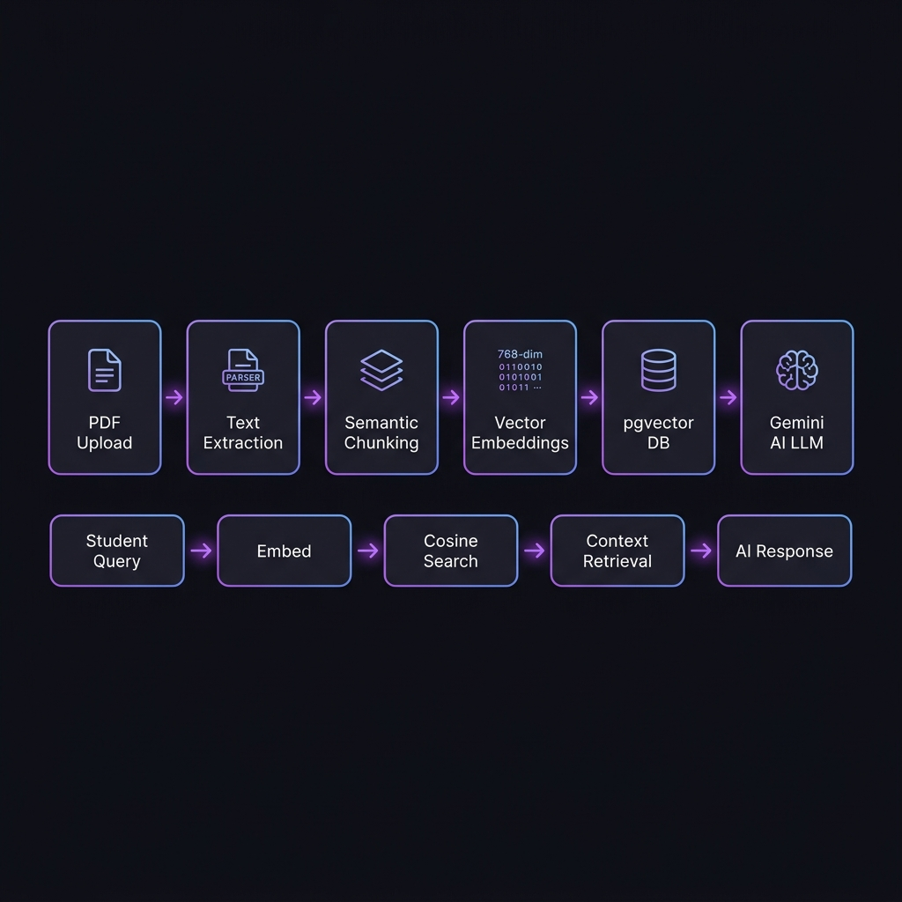
</p>

### High-Level Architecture

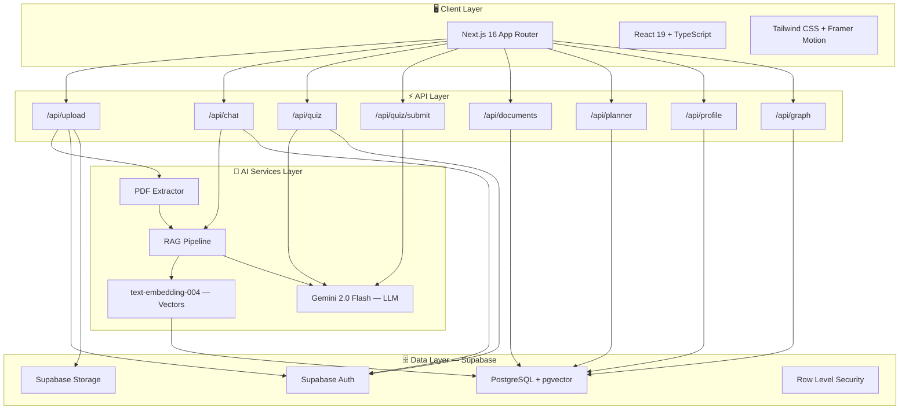

### RAG Pipeline — Deep Dive

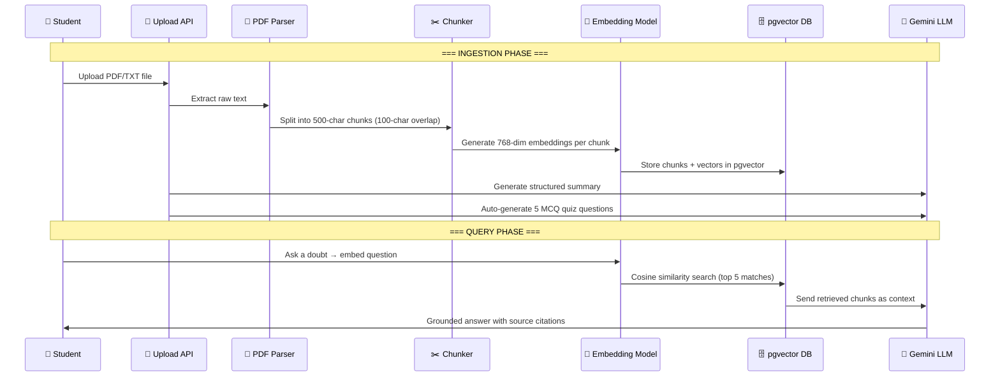

### Data Flow Architecture

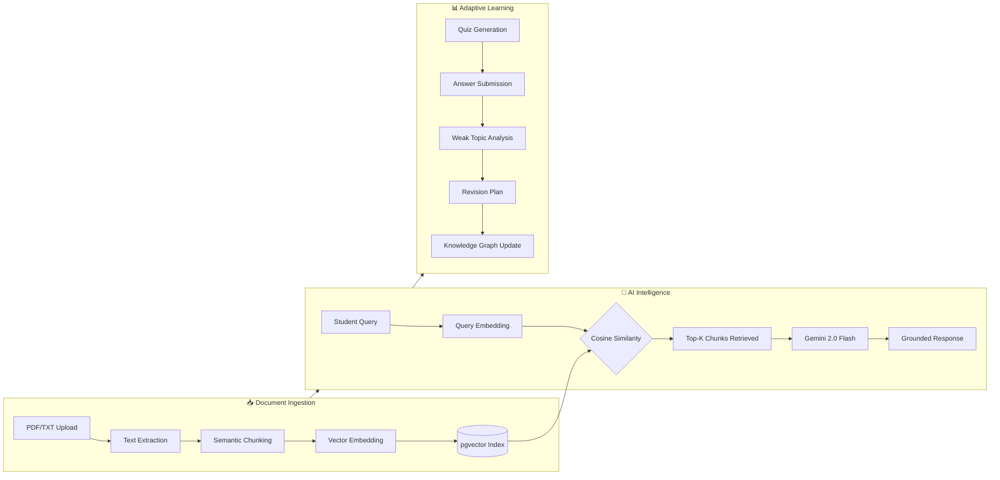

---

## 📊 Comparative Analysis

### AskMe AI vs. Existing EdTech Platforms

<table>
<thead>
<tr>
<th align="left">Capability</th>
<th align="center">AskMe AI 🧠</th>
<th align="center">ChatGPT</th>
<th align="center">Quizlet</th>
<th align="center">Notion AI</th>
<th align="center">Khan Academy</th>
<th align="center">Anki</th>
</tr>
</thead>
<tbody>
<tr>
<td><strong>Learns from YOUR material</strong></td>
<td align="center">✅ RAG-grounded</td>
<td align="center">❌ Generic</td>
<td align="center">❌ Manual cards</td>
<td align="center">⚠️ Page-level</td>
<td align="center">❌ Fixed curriculum</td>
<td align="center">❌ Manual</td>
</tr>
<tr>
<td><strong>Source-cited answers</strong></td>
<td align="center">✅ Chunk refs</td>
<td align="center">❌ No sources</td>
<td align="center">❌ N/A</td>
<td align="center">❌ No citations</td>
<td align="center">❌ N/A</td>
<td align="center">❌ N/A</td>
</tr>
<tr>
<td><strong>Auto quiz from notes</strong></td>
<td align="center">✅ AI-generated</td>
<td align="center">⚠️ Manual prompt</td>
<td align="center">⚠️ Template-based</td>
<td align="center">❌ None</td>
<td align="center">✅ Pre-built</td>
<td align="center">❌ Manual</td>
</tr>
<tr>
<td><strong>Weak topic detection</strong></td>
<td align="center">✅ AI diagnostics</td>
<td align="center">❌ None</td>
<td align="center">⚠️ Basic stats</td>
<td align="center">❌ None</td>
<td align="center">⚠️ Exercise-level</td>
<td align="center">⚠️ Interval-based</td>
</tr>
<tr>
<td><strong>Reverse Teacher Mode</strong></td>
<td align="center">✅ Unique</td>
<td align="center">❌ None</td>
<td align="center">❌ None</td>
<td align="center">❌ None</td>
<td align="center">❌ None</td>
<td align="center">❌ None</td>
</tr>
<tr>
<td><strong>3D Memory Graph</strong></td>
<td align="center">✅ Interactive</td>
<td align="center">❌ None</td>
<td align="center">❌ None</td>
<td align="center">❌ None</td>
<td align="center">❌ None</td>
<td align="center">❌ None</td>
</tr>
<tr>
<td><strong>Cognitive DNA Profile</strong></td>
<td align="center">✅ 8-axis</td>
<td align="center">❌ None</td>
<td align="center">❌ None</td>
<td align="center">❌ None</td>
<td align="center">⚠️ Basic progress</td>
<td align="center">❌ None</td>
</tr>
<tr>
<td><strong>Revision plan generation</strong></td>
<td align="center">✅ AI-driven</td>
<td align="center">⚠️ If prompted</td>
<td align="center">❌ None</td>
<td align="center">❌ None</td>
<td align="center">⚠️ Suggested</td>
<td align="center">⚠️ SRS only</td>
</tr>
<tr>
<td><strong>Free to deploy</strong></td>
<td align="center">✅ Open source</td>
<td align="center">❌ Paid API</td>
<td align="center">⚠️ Freemium</td>
<td align="center">❌ Paid</td>
<td align="center">✅ Free</td>
<td align="center">✅ Free</td>
</tr>
<tr>
<td><strong>Data ownership</strong></td>
<td align="center">✅ Self-hosted</td>
<td align="center">❌ OpenAI cloud</td>
<td align="center">❌ Quizlet cloud</td>
<td align="center">❌ Notion cloud</td>
<td align="center">❌ KA servers</td>
<td align="center">✅ Local</td>
</tr>
</tbody>
</table>

### Competitive Positioning Map

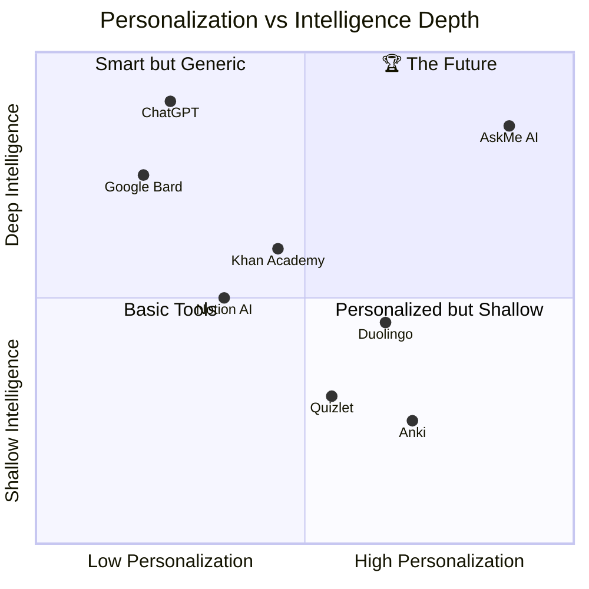

### Why AskMe AI Wins

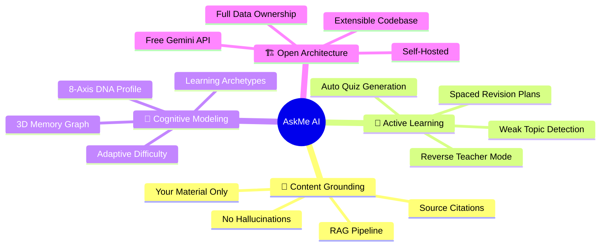

---

## 🗄️ Database Schema

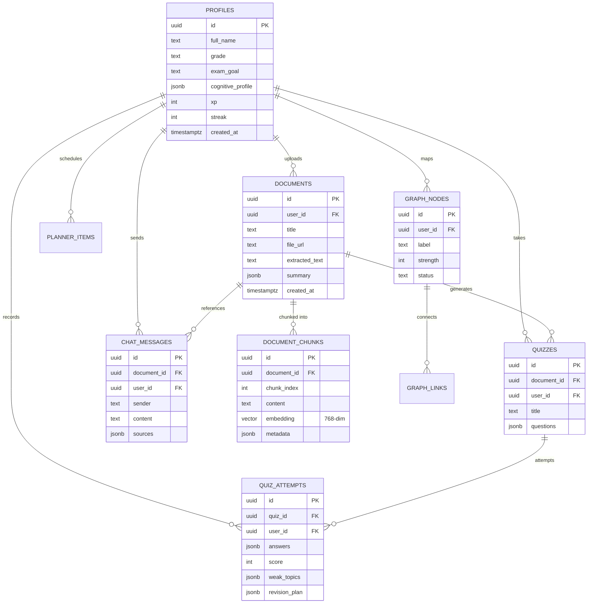

---

## 🤖 AI Pipeline

### Five AI Engines

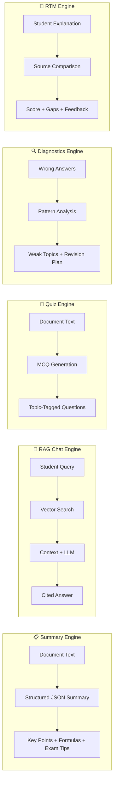

| Engine | Model | Input | Output |
|--------|-------|-------|--------|
| **Summary** | Gemini 2.0 Flash | Extracted document text (15K chars) | Structured JSON: overview, key points, formulas, exam tips, confusions |
| **RAG Chat** | Gemini 2.0 Flash + text-embedding-004 | Student question + top-5 vector-matched chunks | Natural language answer with source citations |
| **Quiz Gen** | Gemini 2.0 Flash | Extracted document text | Array of MCQs with options, correct answer, explanation, topic tag |
| **Diagnostics** | Gemini 2.0 Flash | Wrong answer analysis payload | Weak topics array + revision plan with actions and time estimates |
| **RTM** | Gemini 2.0 Flash | Student explanation + source context | Score (0–100), strengths, gaps, feedback, suggested review topics |

---

## 🛠️ Tech Stack

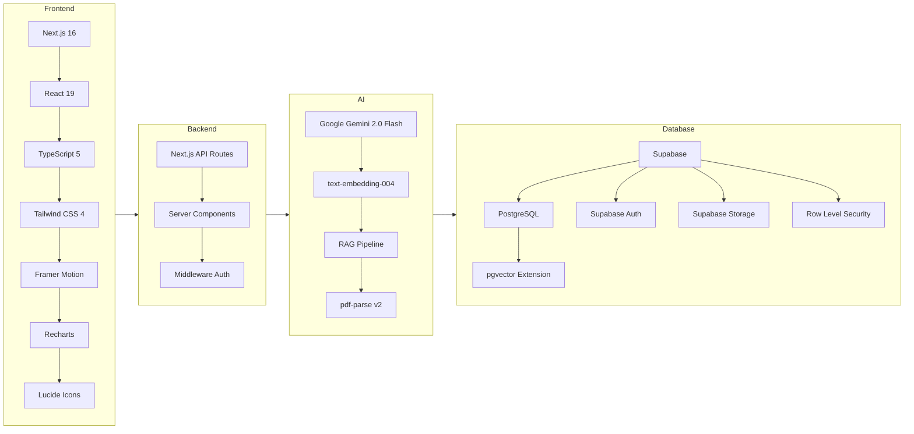

| Layer | Technology | Purpose |
|-------|-----------|---------|
| **Framework** | Next.js 16 (App Router) | Full-stack React framework with server components |
| **Language** | TypeScript 5 | Type-safe development across frontend and backend |
| **Styling** | Tailwind CSS 4 | Utility-first CSS with custom design tokens |
| **Animation** | Framer Motion | Smooth page transitions and micro-interactions |
| **Charts** | Recharts | Dashboard data visualizations |
| **AI Model** | Gemini 2.0 Flash | Primary LLM for all AI features (free tier) |
| **Embeddings** | text-embedding-004 | 768-dimensional vector embeddings |
| **Database** | Supabase PostgreSQL | Relational data + pgvector for similarity search |
| **Auth** | Supabase Auth | Email/password authentication with session management |
| **Storage** | Supabase Storage | Secure file storage for uploaded PDFs |
| **PDF Parsing** | pdf-parse v2 | Server-side PDF text extraction |
| **Deployment** | Vercel | Edge-optimized hosting with serverless functions |

---

## 🚀 Quick Start

### Prerequisites

- **Node.js** ≥ 18.0
- **pnpm** (recommended) or npm
- **Supabase** account ([supabase.com](https://supabase.com))
- **Google AI** API key ([aistudio.google.com](https://aistudio.google.com/apikey))

### 1. Clone & Install

```bash
git clone https://github.com/Suvam-paul145/AskMe-AI.git
cd AskMe-AI
pnpm install
```

### 2. Configure Environment

```bash
cp .env.local.example .env.local
```

Fill in your credentials:

```env
# Supabase (Dashboard → Project Settings → API)
NEXT_PUBLIC_SUPABASE_URL=https://your-project.supabase.co
NEXT_PUBLIC_SUPABASE_ANON_KEY=your-anon-key
SUPABASE_SERVICE_ROLE_KEY=your-service-role-key

# Google AI (aistudio.google.com/apikey)
AI_PROVIDER=gemini
GEMINI_API_KEY=your-gemini-api-key
```

### 3. Initialize Database

1. Go to your **Supabase Dashboard → SQL Editor**
2. Run the migration file: [`supabase/migrations/001_initial_schema.sql`](supabase/migrations/001_initial_schema.sql)
3. Enable the `vector` extension: **Dashboard → Extensions → Search "vector" → Enable**

### 4. Launch

```bash
pnpm dev
```

Open [http://localhost:3000](http://localhost:3000) — you're live! 🎉

---

## 📁 Project Structure

```
askme-ai/
├── app/                          # Next.js App Router pages
│   ├── api/                      # 9 API endpoints
│   │   ├── auth/callback/        # OAuth callback handler
│   │   ├── chat/                 # RAG-powered chat (GET/POST)
│   │   ├── documents/            # Document listing (GET)
│   │   ├── graph/                # Knowledge graph (GET/PATCH)
│   │   ├── planner/              # Study planner CRUD
│   │   ├── profile/              # Cognitive profile (GET/PATCH)
│   │   ├── quiz/                 # Quiz generation (GET/POST)
│   │   │   └── submit/           # Quiz submission + AI analysis
│   │   └── upload/               # File ingestion pipeline
│   ├── chat/                     # RAG chat interface
│   ├── dashboard/                # Analytics dashboard
│   ├── dna/                      # Cognitive DNA profile
│   ├── login/                    # Auth (sign in/sign up)
│   ├── memory-graph/             # 3D knowledge visualization
│   ├── planner/                  # Study session planner
│   ├── quiz/                     # Interactive quiz system
│   ├── settings/                 # User preferences
│   ├── upload/                   # Document upload interface
│   ├── workspace/                # Main study workspace
│   └── page.tsx                  # Cinematic landing page
├── components/                   # Shared UI components
│   ├── navbar.tsx                # Navigation with XP/streak
│   └── footer.tsx                # Site footer
├── lib/                          # Core business logic
│   ├── ai/
│   │   ├── gemini.ts             # Gemini API client (6 functions)
│   │   ├── prompts.ts            # 5 crafted AI prompts
│   │   └── rag.ts                # RAG pipeline (chunk/embed/search)
│   ├── pdf/
│   │   └── extract-text.ts       # PDF text extraction
│   ├── supabase/
│   │   ├── client.ts             # Browser Supabase client
│   │   ├── server.ts             # Server Supabase client
│   │   └── middleware.ts         # Auth session refresh
│   └── store.tsx                 # Global state management
├── supabase/
│   └── migrations/
│       └── 001_initial_schema.sql # Full DB schema + RLS
├── middleware.ts                  # Route protection
└── .env.local                    # Environment configuration
```

---

## 🎬 Demo Flow

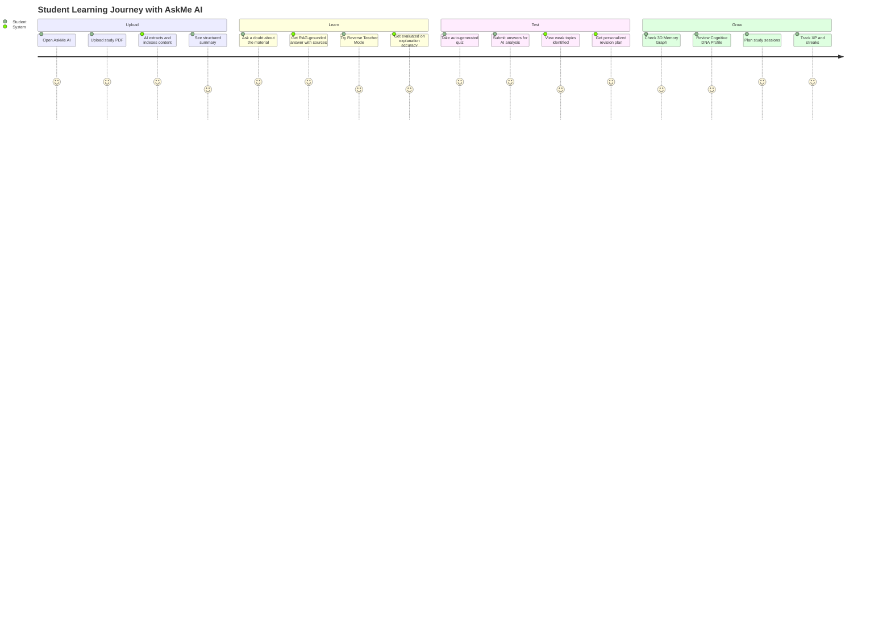

---

## 🔒 Security

- **Row Level Security (RLS)** — Every table has RLS policies ensuring users can only access their own data
- **Server-side API keys** — All AI and database credentials are server-only (never exposed to the client)
- **Auth middleware** — Routes are protected with Supabase session validation
- **Input validation** — File type checking, size limits, and sanitized inputs on all API routes
- **Service role isolation** — Admin operations use a separate service role client

---

## 🗺️ Roadmap

- [ ] 🔊 Voice-based doubt solving
- [ ] 📱 Progressive Web App (PWA) support
- [ ] 🤝 Collaborative study rooms
- [ ] 📷 OCR for handwritten notes
- [ ] 🌍 Multi-language support
- [ ] 📊 Teacher dashboard for classroom analytics
- [ ] 🔗 LMS integration (Google Classroom, Canvas)
- [ ] 🎮 Advanced gamification (badges, leaderboards, challenges)
- [ ] 🧠 Custom fine-tuned models for subject-specific tutoring

---

## 🤝 Contributing

Contributions are welcome! Please feel free to submit a Pull Request.

1. Fork the repository
2. Create your feature branch (`git checkout -b feature/amazing-feature`)
3. Commit your changes (`git commit -m 'Add amazing feature'`)
4. Push to the branch (`git push origin feature/amazing-feature`)
5. Open a Pull Request

---

## 📄 License

This project is licensed under the **MIT License** — see the [LICENSE](LICENSE) file for details.

---

<p align="center">
  <strong>Built with 🧠 by <a href="https://github.com/Suvam-paul145">Suvam Paul</a></strong>
  <br />
  <sub>Powered by Gemini 2.0 Flash • Supabase • Next.js 16</sub>
</p>

<p align="center">
  <a href="https://github.com/Suvam-paul145/AskMe-AI">⭐ Star this repo</a> if AskMe AI helped you learn smarter!
</p>
